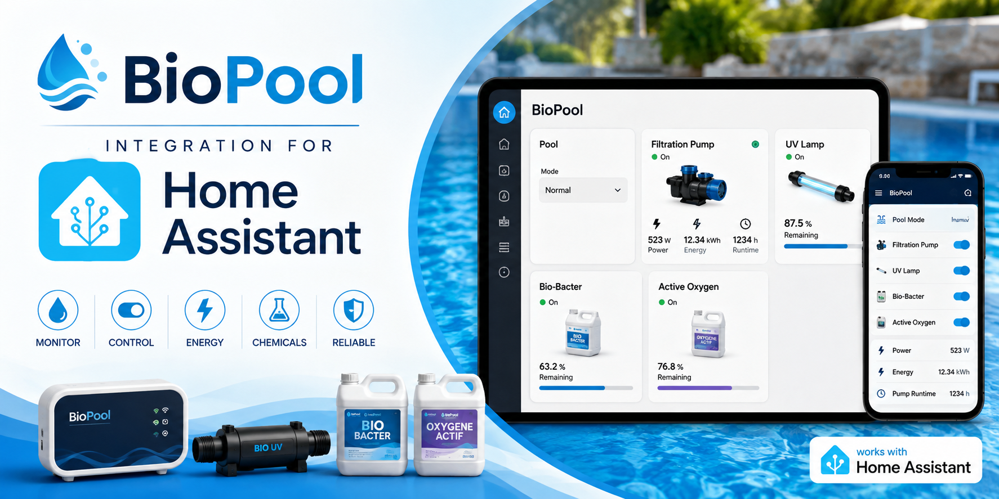
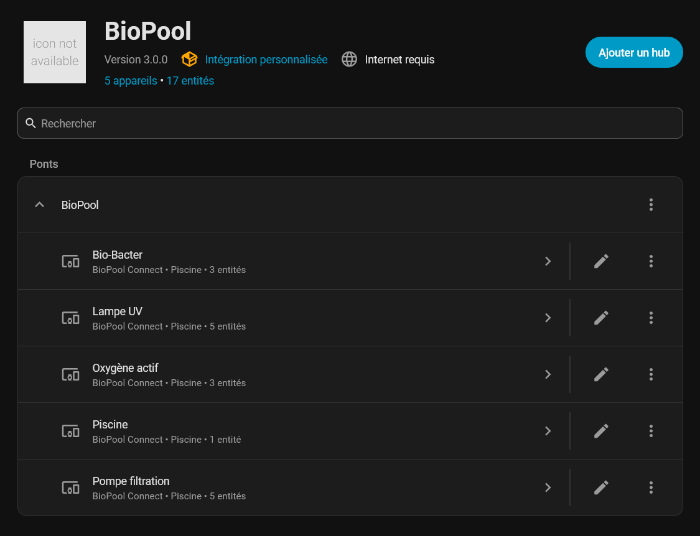
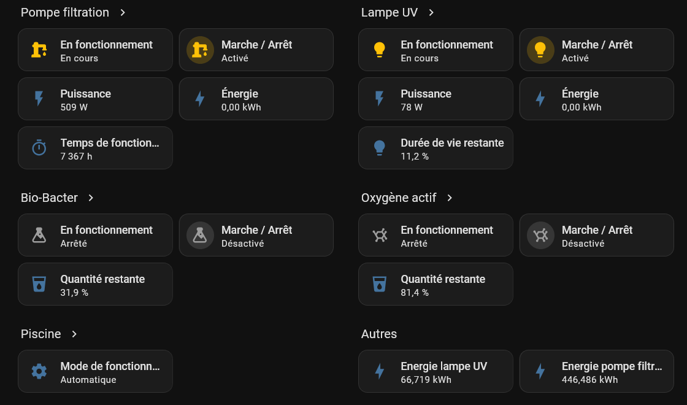
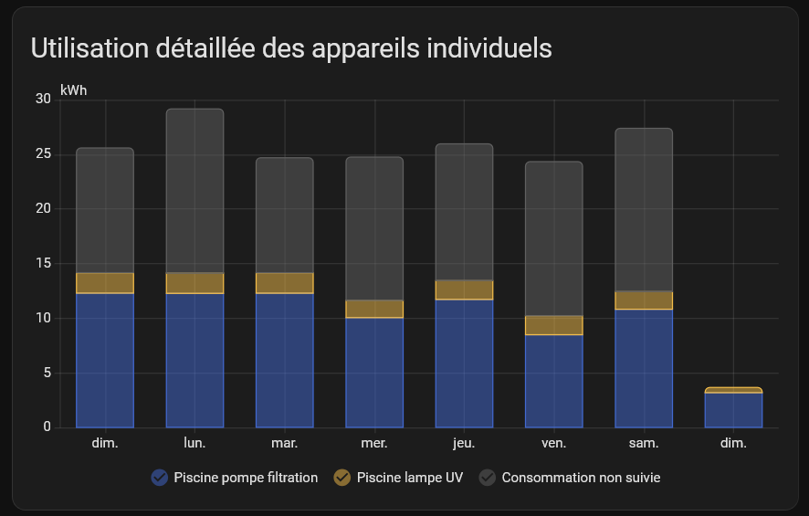

<p align="center">
  
</p>

<h1 align="center">
BioPool Connect Integration for Home Assistant
</h1>

<p align="center">
Monitor and control your BioPool installation directly from Home Assistant.
</p>

<p align="center">


</p>

---

## Features

* 🏊 Pool operating mode selection
* 🔄 Filtration pump control
* 💡 UV lamp control
* 🧪 Bio-Bacter injection control
* 🫧 Active Oxygen injection control
* 🌡️ Pool water temperature monitoring
* 🌡️ Optional external temperature source
* ⚡ Real-time power consumption
* 🔋 Energy monitoring
* ⏱ Pump runtime monitoring
* 💧 Remaining Bio-Bacter level
* 💧 Remaining Active Oxygen level
* 💡 Remaining UV lamp lifetime

The integration automatically creates devices and entities that integrate seamlessly with the Home Assistant device registry.

---

## Supported equipment

The integration automatically discovers and creates the following devices:

### Pool Controller

* Operating mode selector
* Water temperature
* Optional external temperature source

### Filtration Pump

* On/Off switch
* Running status
* Instant power (W)
* Energy consumption (kWh)
* Total operating time (h)

### UV Lamp

* On/Off switch
* Running status
* Instant power (W)
* Energy consumption (kWh)
* Remaining lamp lifetime (%)

### Bio-Bacter

* On/Off switch
* Running status
* Remaining product (%)

### Active Oxygen

* On/Off switch
* Running status
* Remaining product (%)

---

## Temperature

The integration can use the temperature estimated by the BioPool controller.

It is also possible to configure an external Home Assistant temperature sensor.

When an external temperature sensor is enabled, its value is sent to the BioPool controller as the forced water temperature.

The temperature is sent with one decimal place and is only synchronized with the controller when its value changes.

When the external temperature option is disabled, the forced temperature is removed from the controller and the BioPool estimated temperature is used again.

---

## Energy monitoring

The filtration pump and UV lamp expose energy sensors compatible with the Home Assistant Energy Dashboard.

Energy is calculated from the instantaneous power reported by the BioPool equipment.

Energy counters are restored after a Home Assistant restart so that accumulated consumption is preserved.

---

## Installation

### Manual installation

1. Copy the `biopool` folder into:

```text
config/custom_components/
```

2. Restart Home Assistant.

3. Go to:

**Settings → Devices & Services → Add Integration**

4. Search for:

```
BioPool
```

5. Enter your BioPool credentials.

The integration will automatically discover your pool controller.

---

## Configuration

The integration requires your BioPool account credentials.

* Username
* Password

Additional options are available from the integration configuration:

* Use an external temperature entity
* Select the external temperature entity
* Bio-Bacter container size
* Active Oxygen container size
* UV lamp lifetime

---

## Entities

The integration creates:

| Device          | Entities                                                 |
| --------------- | -------------------------------------------------------- |
| Pool            | Operating mode                                           |
| Filtration Pump | Switch, Binary Sensor, Power, Energy, Runtime            |
| UV Lamp         | Switch, Binary Sensor, Power, Energy, Remaining lifetime |
| Bio-Bacter      | Switch, Binary Sensor, Remaining quantity                |
| Active Oxygen   | Switch, Binary Sensor, Remaining quantity                |

---

## Screenshots

### Devices

The integration automatically creates five Home Assistant devices.

<p align="center">
  
</p>


### Dashboard

Example Lovelace dashboard.

<p align="center">
  
</p>


### Energy Dashboard

The filtration pump and UV lamp expose energy sensors compatible with the Home Assistant Energy Dashboard.

<p align="center">
  
</p>

---

## Compatibility

Tested with:

* Home Assistant 2026.7.x
* BioPool Connect Cloud

---

## Roadmap

### Version 1.2

* HACS support
* Services
* Advanced diagnostics
* Additional pool statistics
* Better translations

---

## Issues

If you encounter a problem, please open an issue on GitHub and include:

* Home Assistant version
* Integration version
* Relevant logs

---

## License

This project is licensed under the MIT License.
